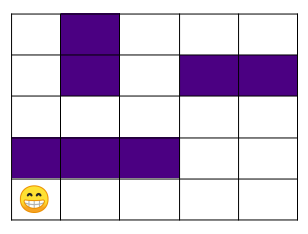
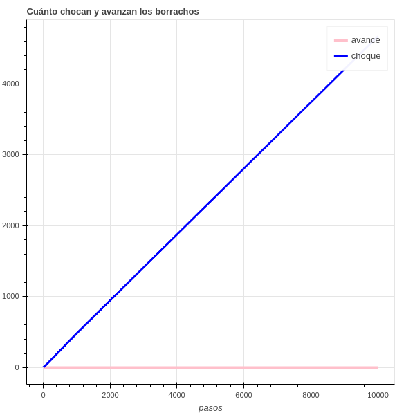

# :six_pointed_star: Caminos Aleatorios 

> Este repositorio representa el ejercicio de la Caminata Aleatoria (1) con una metáfora.

:name_badge: **EN PROCESO** :name_badge:

## Borrachos que Chocan :beers:

Se tienen 10 caminantes (borrachos) que están un mismo punto y van a caminar de forma aleatoria; sin embargo en el espacio en donde se encuentran existen obstáculos (paredes).

Gráfico del espacio y el punto inicial de los borrachos.

Se analizó **qué tanto chocan** y **qué tanto avanzan** estos borrachos si dan 10, 100, 1000 y 10000 pasos, y estos fueron los resultados.

Gráfico de cuánto chocan y cuánto avanzan estos borrachos a medida que dan más pasos.

Cabe destacar que cuando se choca no se avanza, es decir que este avance se refiere a la distancia que los borrachos puedieron recorrer sin tocar los obstáculos.

En la vida real los borrachos logran avanzar porque se ayudan con las paredes, sin embargo ese comportamiento no se está modelando aquí. :joy:

### Otros resultados

||10|100|1000|10000|
|---|---|---|---|---|
|Min cant de choques|0|0|0|0|
|Med cant de choques|0|0|0|0|
|Max cant de choques|0|0|1|1|
|Min avance|0|0|0|0|
|Med avance|0|0|0|0|
|Max avance|0|0|1|1|

## Borrachos Libres :sunrise_over_mountains:

Aquí se tienen 10 borrachos que están en un espacio sin obstáculos.

Este sería el comportamiento

plot de movimiento de borracho 1 y 2 con 10 pasos

plot 3 y 4 con 100 

plot 6 y 8 con 1000

plot 7 y 8 con 10000

### Otros resultados

||10|100|1000|10000|
|---|---|---|---|---|
|Min avance|0|0|0|0|
|Med avance|0|0|0|0|
|Max avance|0|0|1|1|

## :pushpin: Cómo correr los programas

pip freeze > requirements.txt

## :page_with_curl: Bibliografía

(1) https://es.wikipedia.org/wiki/Camino_aleatorio